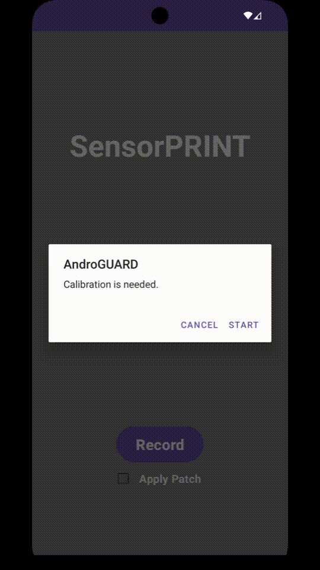

# SensorGUARD
Implement a patch for individual apps to mitigate sensor based fingerprinting.

## Description
It is a further development of [my bachelor's project and thesis](https://github.com/KGeri201/AndroGUARD).  
It is about concealing the inherent error values of built-in sensors in mobile devices, by correcting them, to mitigate fingerprinting attempts.
Patching apps with the created mechanism, using the [A2P2 Framework](https://extgit.iaik.tugraz.at/fdraschbacher/a2p2), obscures the true error values.

## Concept


Apps can be fingerprinted based on the calibration error of the sensors within[*](https://github.com/KGeri201/AndroGUARD/blob/main/thesis/thesis.pdf).  
We mask these errors by recalibrationg the sensors and using these values for the patched apps.  
At the start of the app a calibration window pops up, if there is no calibration file found.  
This makes it possible to calibrate the device only once, and not for every patched app individually.  
We use a very simple method to calibrate the sensors.  
The device has to placed on a flat surface and the difference between the expected values of 0 and the measured values are recorded and stored in a configuration file readable by any other patched app.
Then this error is subtracted from the raw values.  
This reduces the error and brings the values of different devices closer together to make them more difficult to distinguish.
  
## Apply patch to an app
### Prerequisits
- [Java 17](https://adoptium.net/de/temurin/releases/?version=17) installed *- A2P2 jar works on Linux, might not work on Windows.*
- An apk from the app you want the patch apply to.

### Apply

1. Download the latest [distribution](https://extgit.iaik.tugraz.at/fdraschbacher/a2p2/-/blob/main/a2p2_distribution_v1.0.1.zip?ref_type=heads) release from A2P2 and extract it.
2. Download the latest [precompiled version](https://github.com/KGeri201/AndroGUARD-2/releases/latest) of the patch.
3. Execute the command from the [A2P2 documentation](https://extgit.iaik.tugraz.at/fdraschbacher/a2p2/-/tree/main/distribution/docs?ref_type=heads)
    ```bash
    java -jar ./distribution/a2p2.jar <app>.apk ! unpack ! apply sensorguard_static.zip static ! pack ! sign ! ./
    ```
4. Install the patched app on an Android device.

### Build from source
1. Setup the [A2P2](https://extgit.iaik.tugraz.at/fdraschbacher/a2p2/-/tree/main?ref_type=heads) framework for patch development.
2. Clone the project.
3. [Build the patch](https://extgit.iaik.tugraz.at/fdraschbacher/a2p2/-/blob/main/distribution/docs/developing_patches.md?ref_type=heads#building-patches) from source.

## Validation
Check out the [validation](./validation/README.md).  

## License
[MIT License](LICENSE)

## Project status
In development.
