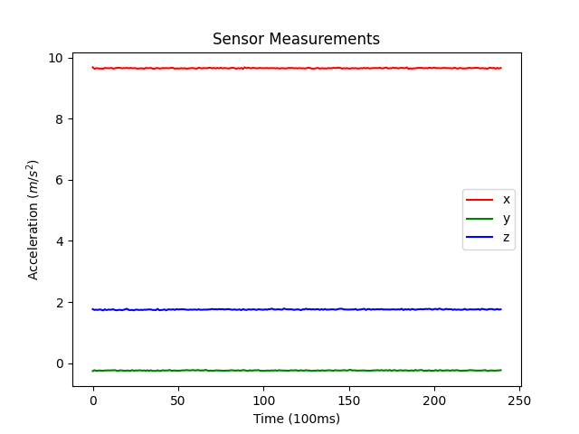
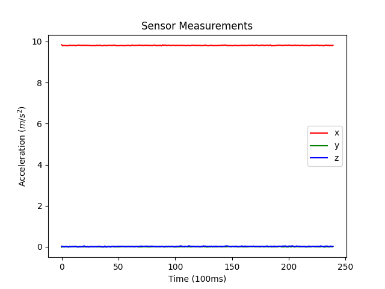
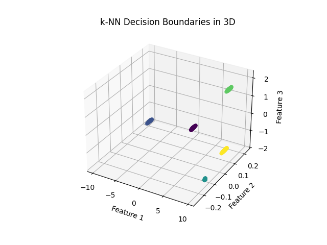
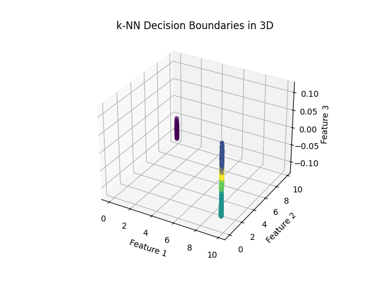

# Validation
Our work is validated by checking the fuctionalty, effectiveness and usability of the patch.  

## Functionality
We have to proove that the sensor values are intercepted, modified and then passed to the original app, without any significant issues.  
To do this we record values with an [android app](https://gitlab.com/sensorkraken/android-app) before and after the application of our patch.

|
--- | ---
Values before the patch  | Values after the patch

As it can be seen, the values were changed after application of the patch.

## Effectiveness
We trained a knn machinde learning algorithm with the patched and prepatched values.  

|
--- | ---
knn decisiion boundaries before the patch  | knn decisiion boundaries after the patch

As it can also be observed in the figures above, the decision boundaries changed notably after the application of our patch.  
The accuracy of the trained model also decreased from 100% accuracy significantly.

## Usability
Usability was tested only in a very, very limited manner.  
We applied the patch to a motion controlled game, and were not able to notice any difference.  
In order to make sure, that our patch does not create any usability issues, further testing with a broad range of functionailites, dependent on motion controll, is required.

## Disclamer
The tests were done on a very limited number of devices in a controlled environment.  
